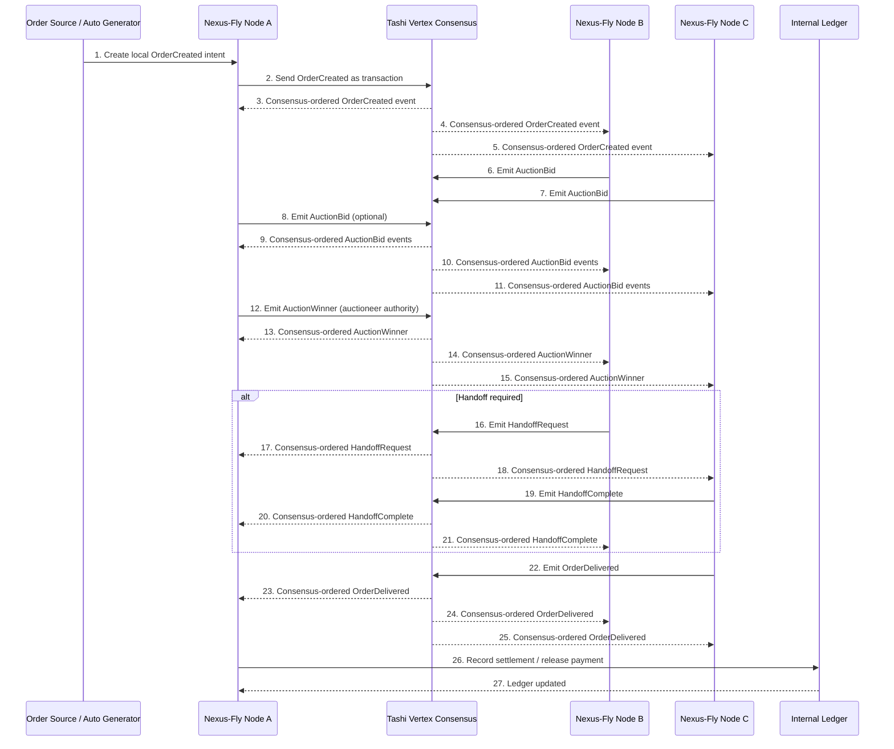

<div align="center">

<pre>
 ███╗   ██╗███████╗██╗  ██╗██╗   ██╗███████╗   ███████╗██╗     ██╗   ██╗
 ████╗  ██║██╔════╝╚██╗██╔╝██║   ██║██╔════╝   ██╔════╝██║     ╚██╗ ██╔╝
 ██╔██╗ ██║█████╗   ╚███╔╝ ██║   ██║███████╗   █████╗  ██║      ╚████╔╝ 
 ██║╚██╗██║██╔══╝   ██╔██╗ ██║   ██║╚════██║   ██╔══╝  ██║       ╚██╔╝  
 ██║ ╚████║███████╗██╔╝ ██╗╚██████╔╝███████║   ██║     ███████╗   ██║   
 ╚═╝  ╚═══╝╚══════╝╚═╝  ╚═╝ ╚═════╝ ╚══════╝   ╚═╝     ╚══════╝   ╚═╝   
</pre>

### The coordination infrastructure for autonomous, serverless logistics fleets

[](https://www.rust-lang.org/)
[](https://tashi.dev)
[](LICENSE)
[](https://www.docker.com/)
[]()
[]()

</div>

---

## Overview

**Nexus-Fly** is a distributed autonomous logistics coordination platform. It enables swarms of heterogeneous agents — drones, ground robots, and e-bikes — to coordinate order assignment, in-flight handoffs, failure recovery, and payment settlement **without relying on a central server**.

Each node in the network participates equally. Critical operational events are ordered through **Tashi Vertex**, a Byzantine Fault Tolerant (BFT) consensus engine, ensuring that all nodes agree on the same sequence of actions even in the presence of network delays, node failures, or adversarial conditions.

Nexus-Fly is not a ride-sharing application. It is an infrastructure layer: a programmable coordination substrate that can power next-generation autonomous delivery systems at scale.

---

## The Problem

Modern autonomous delivery systems face a structural contradiction: they deploy independent mobile agents — drones, robots, cargo bikes — but coordinate them through centralized orchestration servers. This creates several compounding problems:

- **Single point of failure.** If the orchestration server goes down, the entire fleet is blind. No order can be created, assigned, or recovered.
- **Poor coordination across heterogeneous fleets.** Drones, ground robots, and e-bikes have different capabilities, ranges, and charge cycles. Centralized systems struggle to handle this heterogeneity dynamically.
- **Weak handoff support.** Passing a parcel mid-route from a drone to a ground robot requires round-trips through a central coordinator for every validation step.
- **Slow failure recovery.** Detecting that an agent has gone silent, re-auctioning its cargo, and selecting a replacement takes expensive round-trips through a central server.
- **Fragile resilience.** Latency spikes, geographic partitions, or server restarts can stall entire delivery pipelines.

The deeper issue is that **centralized orchestration is fundamentally at odds with truly autonomous, resilient multi-agent systems**.

---

## The Solution

Nexus-Fly replaces the central orchestration server with a distributed event-ordering layer powered by BFT consensus. Instead of agents reporting to a server, they emit signed events that are ordered by the network itself.

Key design decisions:

- **Distributed event coordination.** Critical events (order creation, bids, handoff requests, failures, deliveries) are submitted as consensus transactions. Every node receives the same ordered event stream.
- **Deterministic auction-based assignment.** All nodes run identical auction logic on the same ordered bid set. No central authority decides — every node independently reaches the same conclusion.
- **Cross-agent handoffs.** The handoff protocol validates preconditions (ownership, agent availability) and applies them as consensus-ordered state transitions, enabling safe mid-route parcel transfers.
- **Self-healing recovery.** Heartbeat tracking detects silent agents. Failed deliveries are automatically flagged for re-auction without human intervention.
- **Safety mesh.** Geographic safety zones can be declared by any node. Agents check their position against active zones before proceeding.
- **Internal settlement layer.** An escrow ledger tracks payment obligations, executes handoff fee transfers, and releases final payments on delivery.
- **Modular architecture.** Domain logic is fully decoupled from consensus and I/O, making every module independently testable and replaceable.

---

## Core Capabilities

**Distributed Order Coordination**
Orders are created as consensus events. Every node in the network receives and processes `OrderCreated` in the same sequence, eliminating divergent state across the fleet.

**Autonomous Auction Engine**
All agents submit `AuctionBid` events through consensus. Winner selection is deterministic (ETA, battery level, optional reputation score). Ties are broken lexicographically. No central auctioneer is required.

**Cross-Agent Handoffs**
Mid-route parcel transfers between agents of different types are validated and executed as ordered consensus events. The escrow ledger records partial fee transfers automatically.

**Self-Healing Network**
`HeartbeatTracker` detects silent nodes and identifies in-flight orders that need re-auctioning. The recovery loop runs without operator intervention.

**Safety Mesh**
`SafetyMonitor` maintains active safety zones and evaluates whether any agent position falls within a restricted area. Safety alerts propagate through consensus to all nodes simultaneously.

**Internal Settlement Layer**
`Ledger` tracks escrowed funds, executes partial payments on handoffs, and releases final payments on delivery. No blockchain or external payment system is required for the current MVP.

**Live Simulation and MVP Demo**
`sim/runner.rs` provides a deterministic local simulation of the complete delivery flow, including auction, handoff, failure detection, and settlement. No live network required to run it.

**Vertex-based Distributed Consensus**
The `consensus/vertex.rs` wrapper integrates directly with the Tashi Vertex BFT engine. Nexus-Fly nodes communicate through cryptographically signed transactions ordered by the consensus layer.

---

## System Architecture

Nexus-Fly follows a strict layered architecture. Domain logic never touches the network. The consensus layer never knows about business rules. The simulation can run entirely without real peers.

```
nexus-fly/
+-- Cargo.toml
+-- README.md
+-- config/
|   +-- node1.toml
|   +-- node2.toml
|   +-- node3.toml
|   +-- node4.toml
+-- src/
|   +-- main.rs
|   +-- config.rs
|   +-- app.rs
|   +-- types.rs
|   +-- codec.rs
|   +-- store.rs
|   +-- consensus/
|   |   +-- mod.rs
|   |   +-- vertex.rs
|   +-- domain/
|   |   +-- mod.rs
|   |   +-- agent.rs
|   |   +-- order.rs
|   |   +-- auction.rs
|   |   +-- handoff.rs
|   |   +-- healing.rs
|   |   +-- safety.rs
|   |   +-- ledger.rs
|   +-- sim/
|       +-- mod.rs
|       +-- runner.rs
+-- src/bin/
    +-- keygen.rs
    +-- keyparse.rs
    +-- mvp_demo.rs
    +-- mvp_server.rs
    +-- mvp_config_demo.rs
    +-- vertex_live_node.rs
```

### Module Reference

| Module | Responsibility |
|---|---|
| `config.rs` | Loads `AppConfig` from TOML. Defines the identity, bind address, peers, and agent properties of each node. |
| `types.rs` | The canonical data model. All shared types: `NodeId`, `Order`, `AuctionBid`, `SafetyZone`, `LedgerEntry`, `NexusMessage`. |
| `codec.rs` | Serializes and deserializes `NexusMessage` to and from JSON bytes for transport inside Vertex transactions. |
| `consensus/vertex.rs` | Thin wrapper over the Tashi Vertex Engine. Exposes `start()`, `send_message()`, and `recv_messages()`. |
| `app.rs` | Stateful dispatcher. Holds all in-memory state (orders, bids, peers). Routes incoming `NexusMessage` values to domain handlers. |
| `domain/order.rs` | Pure FSM for the order lifecycle: `Created -> Bidding -> Assigned -> Pickup -> InTransit -> Delivered`. |
| `domain/auction.rs` | Deterministic bid scoring and winner selection. All nodes run the same logic on the same ordered bid set. |
| `domain/handoff.rs` | Validates handoff preconditions and applies the state transition. Integrates with the ledger for fee transfer. |
| `domain/healing.rs` | `HeartbeatTracker` detects silent agents. Returns the set of in-flight orders that need re-auctioning. |
| `domain/safety.rs` | `SafetyMonitor` manages declared safety zones and checks agent positions against them. |
| `domain/ledger.rs` | In-memory escrow ledger: `reserve_escrow -> transfer_for_handoff -> release_final_payment`. |
| `sim/runner.rs` | Local deterministic simulation of the complete MVP delivery flow. No network required. |

---

## Consensus and Event Model

Nexus-Fly is not a blockchain. It does not require every telemetry ping or GPS update to pass through consensus. That would be both slow and unnecessary.

The guiding principle is:

> **Emit intent locally. Advance state only after the consensus-ordered event is received back.**

This means a node that wants to create an order first constructs the `OrderCreated` message locally, then submits it as a Vertex transaction. State does not advance immediately. The node waits for the ordered event to come back from Vertex before updating its local state. When the event returns, it carries a globally agreed sequence number. Every node that receives it applies the same state transition, in the same order.

**Events routed through consensus:**

| Event | Trigger |
|---|---|
| `OrderCreated` | A new delivery order enters the system |
| `AuctionBid` | An agent submits a delivery offer |
| `AuctionWinner` | The deterministic winner is announced |
| `HandoffRequest` | A carrying agent requests a mid-route transfer |
| `HandoffComplete` | A receiving agent accepts the parcel |
| `AgentFailure` | A node is declared silent by the heartbeat tracker |
| `SafetyAlert` / `SafetyClear` | A safety zone is opened or closed |
| `OrderDelivered` | The final agent confirms delivery |

**Events handled locally only:** raw GPS telemetry, battery level telemetry, internal diagnostics.

This separation gives Nexus-Fly low latency on non-critical paths and strong consistency on critical ones.

---

## Sequence Diagram

The following diagram shows how a complete delivery lifecycle flows through the Nexus-Fly network.



---

## MVP Flow

The end-to-end delivery scenario covered by the current MVP:

1. **Order created.** A `CreateOrder` event is emitted by the source node and submitted to Vertex. All nodes receive it and register the new order in `Bidding` state.

2. **Bids submitted.** Each available agent evaluates its readiness (ETA, battery level) and emits an `AuctionBid` through Vertex. All bids arrive at all nodes in the same consensus order.

3. **Winner selected.** The auctioneer node applies deterministic scoring to the ordered bid set and emits `AuctionWinner`. Every node confirms the same result without coordination overhead.

4. **Delivery starts.** The winning agent receives `OrderAssigned`. The escrow ledger reserves the delivery value. The agent reports `PickedUp` and the order transitions to `InTransit`.

5. **Handoff (optional).** If the carrying agent cannot complete the delivery, it emits a `HandoffRequest`. The receiving agent accepts and emits `HandoffComplete`. The ledger executes the partial fee transfer automatically.

6. **Failure detection.** If an agent stops sending heartbeats, `HeartbeatTracker` flags it as silent. Any in-flight orders it was carrying are identified and queued for re-auction.

7. **Delivery completed.** The final agent emits `OrderDelivered`. All nodes advance the order to `Delivered` state.

8. **Settlement recorded.** The responsible node calls the ledger to release the final payment to the agent who completed the delivery.

---

## Current Binaries

| Binary | Purpose |
|---|---|
| `vertex_swarm_demo` | Main CLI node binary. Starts a live Tashi Vertex node with configurable bind address, secret key, and peer list. |
| `keygen` | Generates a new cryptographic key pair (secret + public) for use in node config files. |
| `keyparse` | Parses and validates an existing key string. Useful for debugging configuration issues. |
| `mvp_demo` | Runs the complete delivery scenario locally with hardcoded agents. No config files or network required. |
| `mvp_server` | Starts an MVP message-loop server suitable for integration testing without a full Vertex network. |
| `mvp_config_demo` | Config-driven demo that loads a real `AppConfig` from a TOML file and runs the MVP flow using the configured node identity. |
| `vertex_live_node` | Multi-node capable binary intended for Docker cluster deployments. Reads identity and peer list from `config/nodeN.toml`. |

---

## How to Run

> `tashi-vertex` is a Linux-only native library. On Windows, all `cargo` commands must run inside the Docker development container.

### 1. Start the development environment

```bash
docker compose build
docker compose up -d vertex-dev
docker compose exec vertex-dev bash
```

You are now inside `/workspace` with `rustc`, `cargo`, and `cmake` on `PATH`. Source files are bind-mounted from the host; the `target` directory lives in a named Docker volume.

### 2. Build and test

```bash
cargo build
cargo test
```

Expected result: **61 tests passing, 0 failed**.

### 3. Generate a key pair

```bash
cargo run --bin keygen
```

Paste the output into `config/nodeN.toml` before running live nodes.

### 4. Inspect the main binary CLI

```bash
cargo run --bin vertex_swarm_demo -- --help
```

### 5. Run the local MVP demo

No configuration files or network connection required.

```bash
cargo run --bin mvp_demo
```

### 6. Run the MVP server

```bash
cargo run --bin mvp_server

# Or from PowerShell outside the container:
docker compose exec vertex-dev cargo run --bin mvp_server
```

### 7. Run the config-driven demo

```bash
cargo run --bin mvp_config_demo -- --config config/node1.toml
```

### 8. Start a multi-node Docker cluster

```bash
docker compose up node1 node2 node3
```

### 9. Stream logs from a specific node

```bash
docker compose logs -f node1
docker compose logs -f node2
```

---

## Example Live Logs

```
[node1] INFO  order created: order-7f3a  origin: depot-north
[node1] INFO  auction open -- waiting for bids
[node2] INFO  bid submitted -- eta: 4.2 min, battery: 87%
[node3] INFO  bid submitted -- eta: 6.1 min, battery: 72%
[node1] INFO  winner selected: node2 (score: 0.91)
[node1] INFO  escrow reserved -- 250 units locked
[node2] INFO  order picked up -- status: InTransit
[node2] INFO  handoff request emitted -- target: node3 (battery low)
[node3] INFO  handoff accepted -- ledger transfer: 80 units to node2
[node3] INFO  order delivered -- order-7f3a
[node1] INFO  ledger settled -- node3 credited 170 units (final payment)
[node1] INFO  order-7f3a complete
```

---

## Why This Project is Promising

At the intersection of robotics, distributed systems, and real-world logistics, Nexus-Fly addresses a problem that will only grow in importance as autonomous fleets scale beyond what any central server can manage.

The architecture is deliberately pragmatic. Domain logic is pure Rust with no I/O dependencies, making it easy to audit, test, and extend independently. The consensus layer is pluggable — the `VertexNode` wrapper can be adapted to other BFT engines without touching any domain code.

The "emit locally, advance on consensus receipt" pattern has a clear path toward production-grade deployment. It avoids the race conditions and split-brain failures that plague naive distributed systems, and it mirrors how established distributed databases handle linearizability.

From a development and investment perspective:

- The codebase is modular enough to evolve incrementally without rewrites.
- The simulation layer allows rapid prototyping of new delivery scenarios without live infrastructure.
- The internal ledger can be replaced by an on-chain escrow contract without changing domain logic.
- The architecture scales from a three-node demo to a city-wide fleet coordination layer by adding nodes and extending the live consensus loop.

Nexus-Fly is not a prototype that needs a rewrite. It is a foundation built to be grown.

---

## Current Status

| Component | Status |
|---|---|
| Tashi Vertex node CLI | Working |
| Key generation and parsing | Working |
| TOML config loader | Working |
| Order lifecycle FSM | Working -- 6 tests |
| Auction engine | Working -- 8 tests |
| Handoff protocol | Working -- 5 tests |
| Heartbeat failure detection | Working -- 6 tests |
| Safety zone monitor | Working -- 6 tests |
| Escrow ledger | Working -- 8 tests |
| Codec (encode / decode) | Working -- 7 tests |
| Local MVP simulation | Working -- 12 tests |
| Config-driven demo | Working |
| MVP server binary | Working |
| Live multi-node consensus | Available -- full live wiring in progress |
| Persistent storage | Not implemented (in-memory only) |
| Real GPS distances | Not implemented (Euclidean approximation) |
| External payment integration | Not implemented (internal ledger only) |

---

## Roadmap

**Phase 1 -- Richer live execution**
Complete the live consensus loop by wiring `App::handle_message()` into the Vertex event stream. Automatic bid emission triggered by `OrderCreated` consensus events. Automatic winner announcement after a configurable bid window.

**Phase 2 -- Autonomous delivery progression**
Automatic `PickedUp`, `InTransit`, and `Delivered` state transitions driven by simulated or real agent telemetry. Re-auction triggered automatically on `AgentFailure` detection. Safety zone alerts wired into agent pause logic.

**Phase 3 -- Realistic fleet simulation**
Multi-agent GPS-based simulation with Haversine distance and real route planning. Mixed-fleet scenarios (drones, ground robots, e-bikes with different speed and range profiles). Configurable failure injection for resilience testing.

**Phase 4 -- Observability and operations**
Structured logging with `tracing` and log aggregation. Real-time fleet dashboard via WebSocket or SSE. Prometheus metrics export for node health, order throughput, and auction latency.

**Phase 5 -- Production-grade settlement**
Replace the internal ledger with an on-chain escrow contract. Message authentication: verify `NexusMessage` sender against the consensus-layer public key. Persistent state backend (SQLite or append-only log).

**Phase 6 -- Deployment patterns**
Kubernetes deployment manifests for cloud-based node clusters. Edge deployment on embedded Linux (Raspberry Pi, NVIDIA Jetson). Integration with real drone flight controllers via MAVLink or ROS 2.

---

## Tech Stack

| Technology | Role |
|---|---|
| [Rust](https://www.rust-lang.org/) (2024 edition) | Core language -- safe, fast, zero-cost abstractions |
| [Tokio](https://tokio.rs/) | Async runtime for the live consensus event loop |
| [Tashi Vertex](https://tashi.dev) | BFT consensus and event-ordering engine |
| [Serde + serde_json](https://serde.rs/) | Message serialization and deserialization |
| [TOML](https://toml.io/) | Human-readable node configuration files |
| [Docker + Docker Compose](https://www.docker.com/) | Reproducible development environment and multi-node cluster |
| [Mermaid](https://mermaid.js.org/) | Architecture and sequence diagrams in documentation |

---

<div align="center">

**Nexus-Fly** -- Coordination infrastructure for the autonomous logistics era.

*Built on Rust and Tashi Vertex BFT consensus.*
*Designed for fleets that cannot afford a single point of failure.*

</div>